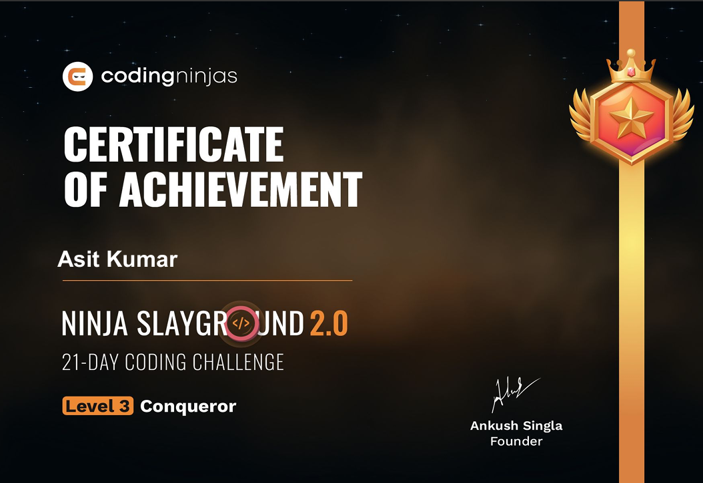

Certificate.png

# 🥷 NINJA-SLAYGROUND-2.0

Welcome to the **NINJA-SLAYGROUND-2.0** repository!  
This is your battleground for the **21 Day Coding Challenge** inspired by Coding Ninjas.  
Sharpen your coding skills, build habits, and push your limits—one day at a time.

---

## 🏅 Certificate of Completion

Congratulations to all finishers!  
You can view or download your official certificate below:

[](./Level%203%20Certificate.pdf)
> **Click the image or the link below to view the certificate PDF.**

👉 [Level 3 Certificate.pdf](./Level%203%20Certificate.pdf)

---

## 🗂️ Repository Structure

```
NINJA-SLAYGROUND-2.0/
├── 📁 Day-01
├── 📁 Day-02
├── ...
├── 📁 Day-21
├── 📄 Level 3 Certificate.pdf
├── 📄 certificate-preview.jpg
├── 📄 README.md
└── 📄 Challenge-Rules.md
```

---

## 🚩 Challenge Overview

- **Duration:** 21 Days
- **Goal:** Solve coding problems daily, build consistency, and master core concepts.
- **Format:** Each day's folder contains unique problems, solutions, and learning resources.

---

## 🎯 How to Participate

1. Fork the repository
2. Complete the daily challenge in the respective day's folder
3. Submit your solution by creating a pull request
4. Track your progress and share insights with the community

> 💡 **Pro Tip:** Stay consistent—coding every day is the real victory!

---

## 📝 Contributing

- Want to add new challenges or improve existing ones?  
  Open a pull request or create an issue!
- Please follow the [challenge rules](Challenge-Rules.md) before submitting.

---

## 🛡️ License

This project is licensed under the [MIT License](LICENSE).

---

## 📬 Contact

Questions, suggestions, or want to share your success story?  
Open an [Issue](https://github.com/Asit-14/NINJA-SLAYGROUND-2.0/issues) or connect with [Asit-14](https://github.com/Asit-14).

---

**Unleash your inner ninja—code, conquer, repeat!** 🥷🚀
